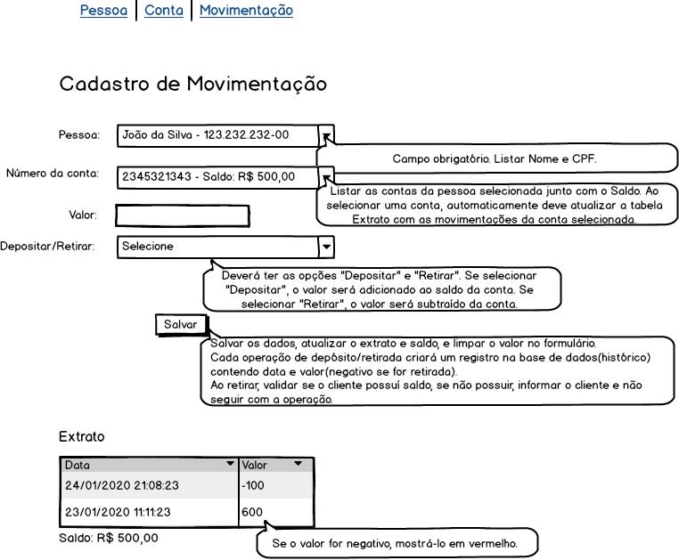

# Prova PHP IST

O desenvolvimento da prova consiste em desenvolver um sistema, conforme especificado nos protótipos abaixo.

**Cadastro de pessoa**


**Cadastro de conta**


**Cadastro de movimentação**



Para a realização da prova, deve-se utilizar a linguagem de programação **PHP**.

Alguns pontos em relação ao desenvolvimento: 
- Pode ser utilizado qualquer framework PHP (Laravel, CodeIgniter, Symfony e outros) para o desenvolvimento.
- Fique a vontade para adicionar bibliotecas e ferramentas externas, caso ache necessário.
- Organize os arquivos do projeto de uma forma adequada (MVC).

# Tecnologias utilizadas
 
<br> 
<br>
<br>
<br>
<br>
<br>


# Instruções para executar o projeto
```bash
# Clone o repositório
$ git clone git@github.com:arraysArrais/fiesc-desafio-fullstack.git

# Navegue até a pasta onde está localizado o ambiente docker
$ cd fiesc-desafio-fullstack/laradock

# Execute o comando abaixo
$ docker-compose up -d nginx mysql phpmyadmin

# Aguarde o término da execução do comando anterior. Na primeira vez pode demorar alguns minutos.

# Após o container subir com a aplicação, acesse no browser o endereço http://localhost:8089/migrate 
# para executar o script de migrations e seeders, criando toda a estrutura necessária no banco de dados

Acessar a aplicação através do endereço http://localhost:8089/
```

## Credenciais de acesso ao banco:

Endereço phpMyAdmin: http://localhost:1010/

- HOST=mysql
- USERNAME=default
- PASSWORD=secret
- DATABASE=default


